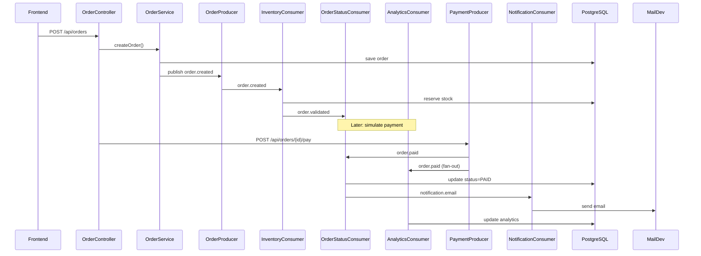
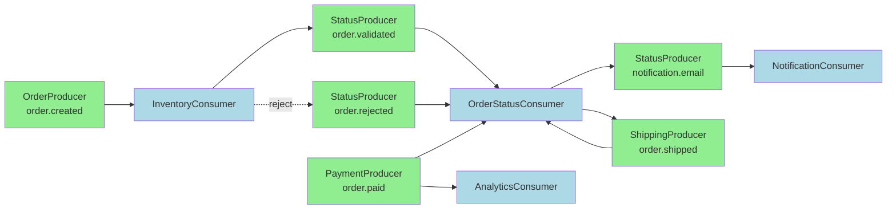

# Kafka Order Management System

Full-stack e-commerce order management demo built with Spring Boot 3, React 18, PostgreSQL 15, and Apache Kafka in KRaft mode.

## What it demonstrates

- Order pipeline orchestration across Kafka topics: `order.created`, `order.validated`, `order.rejected`, `order.paid`, `order.shipped`, and `notification.email`
- Fan-out consumption on `order.paid` by both order status processing and analytics
- Manual acknowledgment for Kafka consumers
- Dead-letter publishing to `order.dlq`
- Real-time frontend polling every 3 seconds
- HTML email notifications through MailDev

## Project structure

```text
backend/   Spring Boot API + Kafka producers/consumers + PostgreSQL persistence
frontend/  React + Vite + Tailwind dashboard
docker-compose.yml
README.md
```

## Prerequisites

- Docker Desktop
- Java 17 and Maven if you want to run the backend outside Docker
- Node.js 20+ if you want to run the frontend outside Docker

## Start everything with Docker Compose

1. Open a terminal in the project root.
2. Run:

```bash
docker compose up --build
```

3. Wait for all containers to become healthy.

## Service URLs

- Frontend: [http://localhost:3000](http://localhost:3000)
- Backend API: [http://localhost:8081](http://localhost:8081)
- Kafka UI: [http://localhost:8080](http://localhost:8080)
- MailDev UI: [http://localhost:1080](http://localhost:1080)
- PostgreSQL: `localhost:5432`

## Local development

### Backend

```bash
cd backend
mvn spring-boot:run
```

Environment defaults are already set in `backend/src/main/resources/application.yml`.

### Frontend

```bash
cd frontend
npm install
npm run dev
```

## API overview

- `POST /api/orders` place a new order
- `GET /api/orders` list all orders
- `GET /api/orders/{id}` get order details
- `POST /api/orders/{id}/pay` simulate payment
- `GET /api/products` list products
- `POST /api/products` create a product
- `GET /api/customers` list customers
- `POST /api/customers` create a customer
- `GET /api/analytics/daily` get in-memory paid order summary
- `GET /api/notifications/{orderId}` get notification history

## Kafka flow

See the diagrams below. View them individually:

1. Placing an order saves the order in PostgreSQL and publishes `order.created`.
2. `InventoryConsumer` validates stock:
   If stock is available, it reserves stock and publishes `order.validated`.
   If stock is insufficient, it publishes `order.rejected`.
3. `OrderStatusConsumer` updates order state in PostgreSQL and emits `notification.email`.
4. Payment is simulated through `POST /api/orders/{id}/pay`, which publishes `order.paid` on success.
5. `order.paid` is consumed by both `OrderStatusConsumer` (updates status to PAID, publishes shipping and notifications) and `AnalyticsConsumer` (updates metrics).

## Architecture Diagrams

2. **[Order Lifecycle Sequence](diagrams/order-lifecycle-sequence-fixed.md)**
3. **[Kafka Topics & Fan-out](diagrams/kafka-topics-fanout-fixed.md)**

Individual diagram files are ready for conversion to PNG/SVG using Mermaid CLI:

```bash
# Install mermaid CLI globally if needed
npm install -g @mermaid-js/mermaid-cli

# Convert example
mmdc -i diagrams/architecture-overview.md -o diagrams/architecture-overview.png
```

</xai:function_call >

<xai:function_call name="edit_file">
<parameter name="path">TODOmd
   `AnalyticsConsumer` in a separate consumer group to update daily sales metrics.
6. Shipping publishes `order.shipped`, which updates the order and triggers another email notification.

## Architecture Diagrams

### 1. High-Level System Architecture

```mermaid
graph TD
    subgraph Frontend ["Frontend React"]
        A[Place Order<br/>Dashboard] --> B[API Calls]
    end
    subgraph Backend ["Spring Boot Backend"]
        C[Controllers<br/>(Order, Payment)] --> D[Services<br/>(OrderService)]
        D --> E[Producers<br/>(OrderProducer<br/>PaymentProducer<br/>StatusProducer<br/>ShippingProducer)]
    end
    subgraph Kafka ["Apache Kafka KRaft"]
        I[order.created]
        J[order.validated]
        K[order.rejected]
        L[order.paid]
        M[order.shipped]
        N[notification.email]
        O[order.dlq]
    end
    subgraph Consumers ["Kafka Consumers"]
        P[InventoryConsumer<br/>(stock validation)]
        Q[OrderStatusConsumer<br/>(status updates)]
        R[AnalyticsConsumer<br/>(metrics)]
        S[NotificationConsumer<br/>(emails)]
    end
    subgraph External ["External Services"]
        T[PostgreSQL<br/>(orders, products)]
        U[MailDev<br/>(email testing)]
        V[In-memory Analytics]
    end
    
    B --> C
    E --> I
    I --> P
    P --> J
    P --> K
    J --> Q
    K --> Q
    F[Payment API] --> L
    L --> Q
    L -.->|fan-out| R
    Q --> M
    Q --> N
    M --> H[Shipping]
    N --> S
    S --> U
    P --> T
    Q --> T
    R --> V
    
    classDef kafka fill:#f9d71c,stroke:#333,stroke-width:2px
    class Kafka kafka
```

### 2. Order Lifecycle Sequence



### 3. Kafka Topics & Fan-out


</xai:function_call >

<xai:function_call name="edit_file">
<parameter name="path">TODO.md

## Seed data

- 5 customers
- 10 electronics products

These are loaded automatically from `backend/src/main/resources/data.sql`.

## Demo tips

- Use the Place Order page to create a new order.
- Watch order status changes on the Orders page.
- Click Pay once an order becomes `VALIDATED`.
- Open MailDev to inspect the HTML emails sent for each status change.
- Open Kafka UI to inspect topics, partitions, and message payloads.
