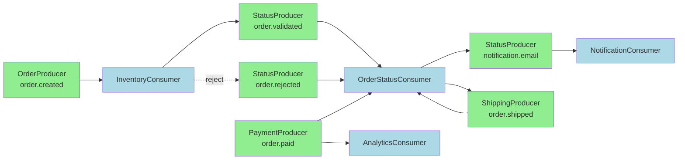

# Kafka Topics & Fan-out (CLI Fixed)

```mermaid
graph LR
    OP["OrderProducer<br/>order.created"] --> IC["InventoryConsumer"]
    IC --> OV["StatusProducer<br/>order.validated"]
    IC -.->|reject| OR["StatusProducer<br/>order.rejected"]
    PP["PaymentProducer<br/>order.paid"] --> OSC["OrderStatusConsumer"]
    PP --> AC["AnalyticsConsumer"]
    OV --> OSC
    OR --> OSC
    OSC --> NS["StatusProducer<br/>notification.email"]
    OSC --> SP["ShippingProducer<br/>order.shipped"]
    NS --> NC["NotificationConsumer"]
    SP --> OSC
    
    classDef producer fill:#90EE90
    classDef consumer fill:#ADD8E6
    class OP,OV,OR,PP,NS,SP producer
    class IC,OSC,AC,NC consumer
```

