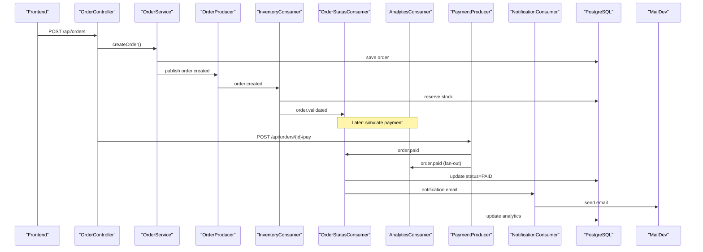

# Order Lifecycle Sequence (CLI Fixed)

```mermaid
sequenceDiagram
    participant F as "Frontend"
    participant API as "OrderController"
    participant OS as "OrderService"
    participant OP as "OrderProducer"
    participant IC as "InventoryConsumer"
    participant OSC as "OrderStatusConsumer"
    participant AC as "AnalyticsConsumer"
    participant PP as "PaymentProducer"
    participant NC as "NotificationConsumer"
    participant DB as "PostgreSQL"
    participant Email as "MailDev"
    
    F->>API: POST /api/orders
    API->>OS: createOrder()
    OS->>DB: save order
    OS->>OP: publish order.created
    OP->>IC: order.created
    IC->>DB: reserve stock
    IC->>OSC: order.validated
    Note over OSC,AC: Later: simulate payment
    API->>PP: POST /api/orders/{id}/pay
    PP->>OSC: order.paid
    PP->>AC: order.paid (fan-out)
    OSC->>DB: update status=PAID
    OSC->>NC: notification.email
    NC->>Email: send email
    AC->>DB: update analytics
```

